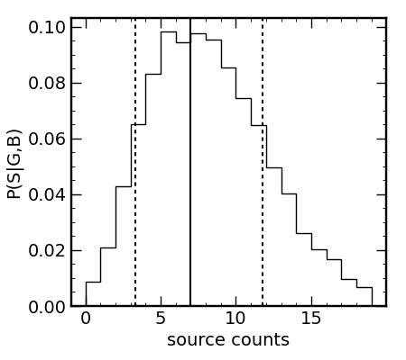

# FeldCous
Robust statistics of low count sources (the "correct" way),
including detection probabilities, confidence intervals, 
and sampling of the highly non-Gaussian probability 
distributions. Detection probabilities and confidence 
intervals calculated based on the
Feldman & Cousins (1998) treatment of 
very faint sources in counting experiments with estiamtes
of the background signal (like CCDs!). Script also includes
treatments for non-detections (calculating upper limits)
and sufficiently bright sources (i.e., Skellam variates).

Sampling of source probability distribution is done by
"empirically" calculating the source cumulative distribution
function given the background and gross counts and using the 
inverse transform method to sample the source probability 
density with a set of uniform random variates.

## References
While this code is provided publicly, I request that any use 
thereof be cited in any publications in which this code is used.
I developed and implemented this script for Flury et al. 2022 ApJS 260, 1
based on Feldman & Cousins. 1998. PhysRevD 57, 3873 in order 
to properly handle faint signals in observations by _HST_/COS.

## Example Usage - Source Detection and Confidence Intervals
``` python 
from FeldCous import *
grs = 16 # gross counts -- 16 for simple sig = sqrt(16) = 4
bkg = 9  # background counts -- 9 for simple sig = sqrt(9) = 3
pdet = calc_det_prob(grs,bkg) # get detection probability
print(f'P(>N|B) = {pdet[0]:.3e}, {pdet[1]:.3f} sigma detection')
src,src_lo,src_up = calc_source(grs,bkg) # get 1-sigma confidence intervals
print(f'source counts: {src:0.3f}+{src_up:.3f}-{src_lo:.3f}')
```
which prints the following to the command line
```
P(>N|B) = 1.111e-02, 2.287 sigma detection
source counts: 7.000+4.790-3.660
```

## Example Usage - Drawing Faint Source Samples
``` python 
from FeldCous import *
grs = 16 # gross counts -- 16 for simple sig = sqrt(16) = 4
bkg = 9  # background counts -- 9 for simple sig = sqrt(9) = 3
from numpy import linspace
n = sample_source(grs,bkg,linspace(0,1,101),n_samp=10000)
```
which produces the following distribution of source variates with median and confidence intervals from `calc_source` shown as solid and dashed lines, respectively.



## BibTeX
Flury et al. 2022 ApJS 260, 1
``` bibtex
@ARTICLE{2022ApJS..260....1F,
       author = {{Flury}, Sophia R. and {Jaskot}, Anne E. and {Ferguson}, Harry C. and {Worseck}, G{\'a}bor and {Makan}, Kirill and {Chisholm}, John and {Saldana-Lopez}, Alberto and {Schaerer}, Daniel and {McCandliss}, Stephan and {Wang}, Bingjie and {Ford}, N.~M. and {Heckman}, Timothy and {Ji}, Zhiyuan and {Giavalisco}, Mauro and {Amorin}, Ricardo and {Atek}, Hakim and {Blaizot}, Jeremy and {Borthakur}, Sanchayeeta and {Carr}, Cody and {Castellano}, Marco and {Cristiani}, Stefano and {De Barros}, Stephane and {Dickinson}, Mark and {Finkelstein}, Steven L. and {Fleming}, Brian and {Fontanot}, Fabio and {Garel}, Thibault and {Grazian}, Andrea and {Hayes}, Matthew and {Henry}, Alaina and {Mauerhofer}, Valentin and {Micheva}, Genoveva and {Oey}, M.~S. and {Ostlin}, Goran and {Papovich}, Casey and {Pentericci}, Laura and {Ravindranath}, Swara and {Rosdahl}, Joakim and {Rutkowski}, Michael and {Santini}, Paola and {Scarlata}, Claudia and {Teplitz}, Harry and {Thuan}, Trinh and {Trebitsch}, Maxime and {Vanzella}, Eros and {Verhamme}, Anne and {Xu}, Xinfeng},
        title = "{The Low-redshift Lyman Continuum Survey. I. New, Diverse Local Lyman Continuum Emitters}",
      journal = {\apjs},
     keywords = {Reionization, Galactic and extragalactic astronomy, Ultraviolet astronomy, Hubble Space Telescope, 1383, 563, 1736, 761, Astrophysics - Astrophysics of Galaxies, Astrophysics - Cosmology and Nongalactic Astrophysics},
         year = 2022,
        month = may,
       volume = {260},
       number = {1},
          eid = {1},
        pages = {1},
          doi = {10.3847/1538-4365/ac5331},
archivePrefix = {arXiv},
       eprint = {2201.11716},
 primaryClass = {astro-ph.GA},
       adsurl = {https://ui.adsabs.harvard.edu/abs/2022ApJS..260....1F},
      adsnote = {Provided by the SAO/NASA Astrophysics Data System}
}
```

Zenodo DOI

[](https://doi.org/10.5281/zenodo.14857986)


Feldman & Cousins. 1998. PhysRevD 57, 3873
``` bibtex
@ARTICLE{1998PhRvD..57.3873F,
       author = {{Feldman}, Gary J. and {Cousins}, Robert D.},
        title = "{Unified approach to the classical statistical analysis of small signals}",
      journal = {\prd},
     keywords = {06.20.Dk, 14.60.Pq, Measurement and error theory, Neutrino mass and mixing, Physics - Data Analysis, Statistics and Probability, High Energy Physics - Experiment},
         year = 1998,
        month = apr,
       volume = {57},
       number = {7},
        pages = {3873-3889},
          doi = {10.1103/PhysRevD.57.3873},
archivePrefix = {arXiv},
       eprint = {physics/9711021},
 primaryClass = {physics.data-an},
       adsurl = {https://ui.adsabs.harvard.edu/abs/1998PhRvD..57.3873F},
      adsnote = {Provided by the SAO/NASA Astrophysics Data System}
}
```

## Licensing
This program is free software: you can redistribute it and/or modify it under the terms of the GNU General Public License as published by the Free Software Foundation, either version 3 of the License, or (at your option) any later version.

This program is distributed in the hope that it will be useful, but WITHOUT ANY WARRANTY; without even the implied warranty of MERCHANTABILITY or FITNESS FOR A PARTICULAR PURPOSE. See the GNU General Public License for more details.

You should have received a copy of the GNU General Public License along with this program. If not, see <https://www.gnu.org/licenses/>.
